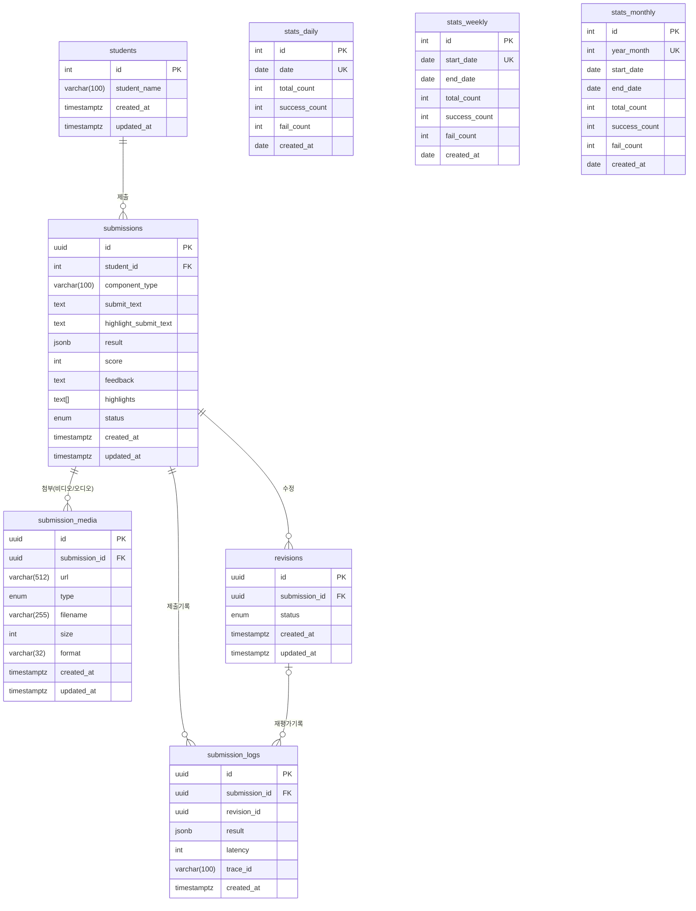

# Essay Evaluation Service
AI 기반 에세이 자동 평가 및 재평가, 미디어 파일 처리, 통계 집계 기능을 제공하는 NestJS 기반 백엔드 서비스

## 실행 방법
### 1. 환경변수 설정

```bash
cp .env.example .env
```

- .env 파일 내용 설정
```
NODE_ENV=production
PORT=3000

# chat completion information
AZURE_ENDPOINT_URL=
AZURE_ENDPOINT_KEY=
OPENAI_API_VERSION=
AZURE_OPENAI_DEPLOYMENT_NAME=

# blob storage
AZURE_ACCOUNT_KEY=
AZURE_ACCOUNT_NAME=
AZURE_CONNECTION_STRING=
AZURE_CONTAINER=

# postgres 설정 : docker compose 파일에서 사용
POSTGRES_USER=
POSTGRES_PASSWORD=
POSTGRES_DB=
POSTGRES_PORT=

# prisma connection에 사용
# 위에서 설정한 POSTGRES_USER, POSTGRES_PASSWORD, POSTGRES_DB를 사용하여 값을 설정합니다
DATABASE_URL="postgresql://${POSTGRES_USER}:${POSTGRES_PASSWORD}@db:5432/${POSTGRES_DB}?schema=public"
#example)"postgresql://username:1234@db:5432/dbname?schema=public"

# jwt 설정
JWT_SECRET=
JWT_EXPIRES_IN=30d
```


### 2. 서버 실행
```bash
docker compose up --build -d
```

- 이 단계에서 5개의 students 정보가 시딩됩니다.
- 시딩된 학생 정보는 아래와 같습니다. 참고하여 테스트 진행 할 수 있습니다.
    ```json
    {
      id: 1,
      studentName: '김민준',
    },
    {
      id: 2,
      studentName: '이서연',
    },
    {
      id: 3,
      studentName: '박지우',
    },
    {
      id: 4,
      studentName: '최현우',
    },
    {
      id: 5,
      studentName: '정수아',
    },
    ```


### 3. swagger 주소
```
http://localhost:${APP_PORT}/api-docs
```

### 4. unit test
```bash
pnpm install && pnpm test
```


### 5. 서버 종료
```bash
docker compose down
```

## 모듈 구조 및 관계
- config: 환경설정 및 환경변수 검증
- logger: 커스텀 로깅 및 모듈별 로깅
- prisma: DB 접근 및 트랜잭션 관리
- submission: 과제 제출/수정 관리
- revision: 재평가 요청 및 이력 관리
- evaluation: AI 평가 엔진 연동
- ai: OpenAI 등 외부 AI API 연동
- blob-storage: 미디어 파일 업로드/다운로드
- video-processing: 동영상 등 미디어 전처리
- common: 공통 DTO, 데코레이터, 상수 등


## ERD



## 평가 프로세스

### 1. 최초 제출 및 평가 (POST /v1/submission)


```mermaid

flowchart TD
sequenceDiagram
    participant User
    participant SubmissionController
    participant SubmissionService
    participant VideoProcessingService
    participant BlobStorageService
    participant PrismaDB
    participant EvaluationService
    participant AiService

    User->>SubmissionController: 비디오 파일 업로드 요청
    SubmissionController->>SubmissionService: createSubmission(videoPath)
    SubmissionService->>VideoProcessingService: processVideo(videoPath)
    VideoProcessingService-->>SubmissionService: [미디어 메타데이터 배열]
    loop 각 미디어 파일
        SubmissionService->>BlobStorageService: uploadFileAndGetSasUrl(media.path, media.filename)
        BlobStorageService-->>SubmissionService: SAS URL
    end
    SubmissionService->>PrismaDB: 제출 및 미디어 정보 저장
    SubmissionService->>VideoProcessingService: deleteMedia(filename)
    SubmissionService-->>SubmissionController: 제출 결과(미디어 URL 포함)
    SubmissionController-->>User: 제출 결과 응답
    SubmissionService->>EvaluationService: evaluate(submission)
    EvaluationService->>AiService: AI 평가 요청
    AiService-->>EvaluationService: AI 평가 결과
    EvaluationService-->>SubmissionService: 평가 결과(score, feedback, highlights)
    SubmissionService->>PrismaDB: 제출물 평가 결과 갱신
    SubmissionService-->>SubmissionController: 최종 결과 응답
    SubmissionController-->>User: 최종 결과 응답

```

### 2. 재평가 (POST /v1/revision)
```mermaid
sequenceDiagram
    participant Client
    participant RevisionController
    participant RevisionService
    participant SubmissionRepository
    participant RevisionRepository
    participant EvaluationService

    Client->>RevisionController: POST /revision { submissionId }
    RevisionController->>RevisionService: createRevision(submissionId)
    RevisionService->>SubmissionRepository: findById({ where: { id: submissionId } })
    RevisionService->>RevisionRepository: create({ data: { submissionId, status: PENDING } })
    RevisionService->>EvaluationService: evaluate(submission, revisionId)
    EvaluationService-->>RevisionService: (평가 결과)
    RevisionService->>RevisionRepository: update({ where: { id: revisionId }, data: { status: COMPLETED } })
    RevisionService->>SubmissionRepository: findById({ where: { id: submissionId }, include: { student, media } })
    RevisionService-->>RevisionController: SubmissionResponseDto 반환
    RevisionController-->>Client: SubmissionResponseDto
    end

```


